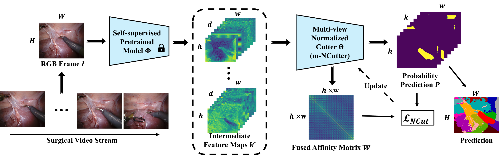

# AMNCutter

Code for our paper (unpublished) **[AMNCutter: Affinity-Attention-Guided Multi-View Normalized Cutter for Unsupervised Surgical Instrument Segmentation](hyperlink)**

## Method Overview



## Setup
* Recommended Environment: Python 3.10.0+, Cuda 12.0+
* Install dependencies: `pip install -r requirements.txt`.

## Dataset Directory
```
dataset
    └── DatasetName
        ├── groundTruth
        │   ├── binary
        │   │   ├── videoName1
        │   │   |   ├── frameName1.png
        │   │   |   └── frameName2.png
        │   │   └── videoName2
        │   ├── binaryClassIndicator.json
        │   ├── parts
        │   ├── partsClassIndicator.json
        │   ├── semantic
        │   ├── semanticClassIndicator.json
        │   ├── types
        │   └── typesClassIndicator.json
        └── inputX
            └── originImage
                ├── videoName1
                |   ├── frameName1.png
                |   └── frameName2.png
                └── videoName2
```
A demo dataset is uploaded and is named "Demo".

`groundTruth`: Ground truth masks and class indicators (json files) for all segmentation tasks are stored.

`inputX`: Origin input frames are stored.

## Data Splitting

```bash
python dataPreprocessing/data_train_val_test_split.py --config_file dataPreprocessing/demo_dataset_split.json
```

All datasets and their configuration are listed in the config file, including the training and testing sets.
It will generate a "data_split" directory including 'train.txt', and 'test.txt', under the "DatasetName" directory. `samples.txt` is used for visualization.

Or, you can manually set `txt` files.

## Run

The following command trains an AMNCutter model with the datasets claimed in the 'json' config file.
```bash
python main.py --mode train --config_file configFiles/demo_AMNCutter.json
```


The following command evaluates an AMNCutter model with the datasets claimed in the 'json' config file.
```bash
python main.py --mode test --config_file configFiles/demo_AMNCutter.json
```


The following command visualizes the prediction results and some intermediate feature maps, while it may be slower.
```bash
python main.py --mode test --vis --config_file configFiles/demo_AMNCutter.json
```

Change configurations in the config file as you want, for more experiments.

`python experiment.py` can run a list of training and testing tasks.

## Download Trained Model

Please download [our model weights](https://drive.google.com/drive/folders/1NSS5sTWtBFGevEb_sbWhYjAxE2nOQMLu?usp=drive_link), and merge it with `saved_models`.
Please adjust configuration files in `configFiles` to leverage the downloaded weights.

## Outputs

A directory `outputs` will be generated after running.
It contains csv files of evaluation and output pictures of visualization.


## Citation
unpublished yet


